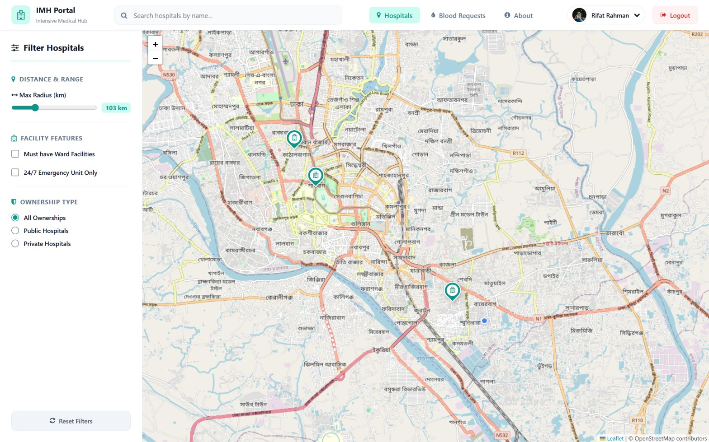
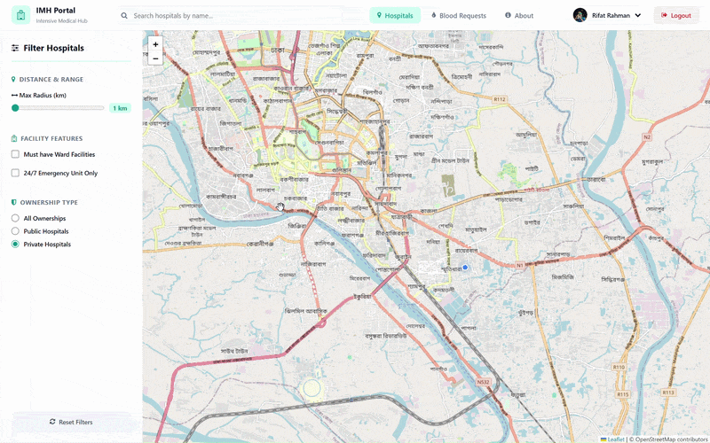
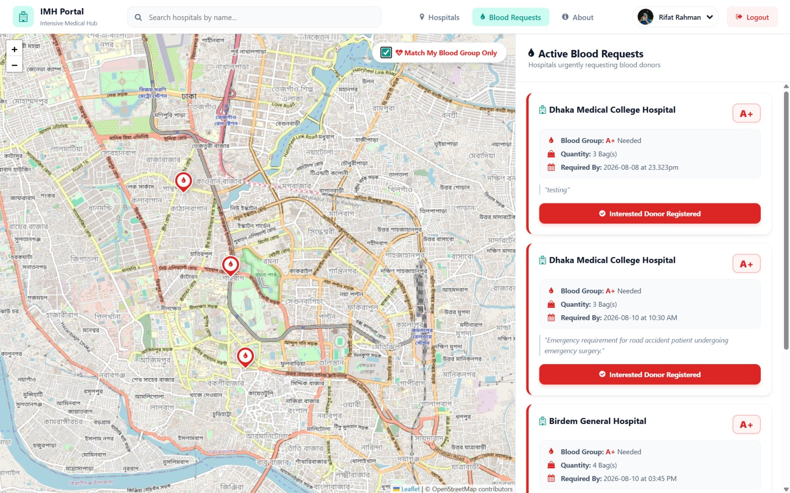
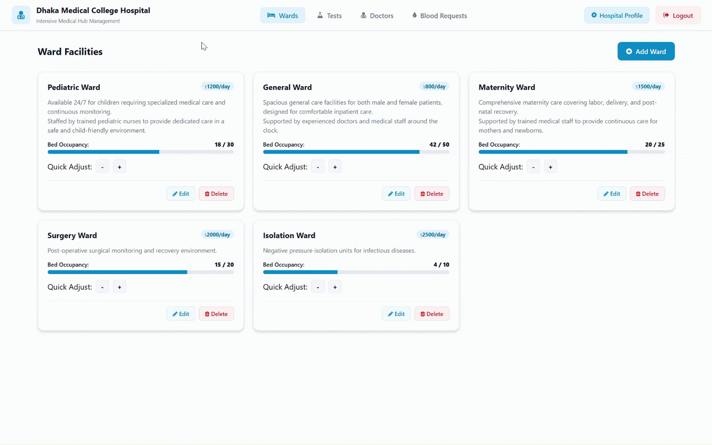

<p align="center">


</p>

# 🏥 Intensive Medical Hub (IMH)

**Intensive Medical Hub (IMH)** is a full-stack healthcare platform that brings hospital information and essential healthcare services together in one place. It allows users to discover hospitals, explore available healthcare resources, view locations through interactive maps, and participate in emergency blood request coordination, while **each hospital has its own dedicated administrative portal to manage and update its facilities, services, and information**.


## 🏆 Award & Academic Recognition

**Intensive Medical Hub (IMH)** achieved **3rd Runner-Up** at the **UIU Project Show – Fall 2023** under the **Database Management Lab** category at **United International University (UIU)**.

### 📸 Award Presentation Ceremony

<div align="center">
  
<p><em>Figure 1: Receiving the 3rd Runner-Up award from United International University (UIU) faculty members at the Fall 2023 Project Show.</em></p>
</div>

---

## ✨ Core Features
- 🗺️ **Hospital Discovery** — Find and explore nearby hospitals using an interactive map and location-based filtering.
- 🏥 **Healthcare Resource Information** — Browse hospital wards, doctors, medical tests, emergency facilities, contact information, and other available resources.
- 🔎 **Hospital Search & Filtering** — Search hospitals and filter them based on distance, ownership, ward availability, and emergency services.
- 🩸 **Emergency Blood Requests** — Hospitals can publish blood requirements, while users can discover requests and register their interest as potential donors.
- ⭐ **Hospital Reviews & Ratings** — Users can review and rate hospitals based on their experience.
- 👤 **User Portal** — Manage personal information, explore hospitals, view healthcare resources, and interact with blood requests.
- 🏨 **Hospital Administration Portal** — Manage hospital profiles, wards, doctors, medical tests, blood requests, and interested donors.
- 📍 **Interactive Maps** — Uses Leaflet.js and OpenStreetMap to provide map-based hospital discovery and location features.


## 📸 User Interface Gallery


### 🖥️ User Dashboard

The main user dashboard provides a location-aware view of nearby hospitals, with interactive map markers, real-time user location, and filtering options for discovering relevant healthcare facilities.

<p align="center">
  
</p>

<p align="center">
  <em>Figure 1: Main user dashboard with interactive hospital map and location-based filtering.</em>
</p>

### 🏥 Hospital Information Panel

The hospital information panel provides users with detailed information about a selected hospital, including ward availability, specialist information, and user reviews. Users can select a hospital directly from a map marker, through filtering, or by using the search feature.

<div align="center">
  
  <p><em>Figure 2: Hospital information panel.</em></p>
</div>

### 🩸 Blood Donation Coordination

The emergency blood request interface displays blood requirements from hospitals on the map, along with the relevant blood request information. Users can select **“Match My Blood Group”** to filter the requests based on their blood type, showing the matching blood requirements and the corresponding hospitals on the map. Users can then select **“I am Interested”** to register their interest as a potential donor.


<div align="center">
  
  <p><em>Figure 3: Emergency blood request and donor matching interface.</em></p>
</div>

### 🛠️ Admin Dashboard — Ward Management

The hospital administration portal provides dedicated management sections for wards, doctors, medical tests, and blood requests. Each resource is displayed in an individual card with its relevant information and provides Edit and Delete actions, allowing hospital administrators to easily update or remove records as needed.

<div align="center">
  
  <p><em>Figure 4: Hospital administration dashboard and resource management.</em></p>
</div>


---

## 🏗️ System Architecture

Intensive Medical Hub follows a **three-layer architecture** consisting of the frontend, Flask backend, and SQLite database. The system provides separate interfaces for users and individual hospital administrators, while both portals communicate with the same backend and database.

```text
                         ┌─────────────────────────────┐
                         │       Intensive Medical Hub │
                         └──────────────┬──────────────┘
                                        │
                    ┌───────────────────┴───────────────────┐
                    │                                       │
          ┌─────────▼─────────┐                   ┌─────────▼─────────┐
          │    User Portal    │                   │ Hospital Admin    │
          │                   │                   │     Portal         │
          │ HTML/CSS/JS       │                   │ HTML/CSS/JS        │
          │ Leaflet.js         │                   │ Leaflet.js        │
          └─────────┬─────────┘                   └─────────┬─────────┘
                    │                                       │
                    └───────────────────┬───────────────────┘
                                        │
                                  HTTP / Fetch API
                                        │
                         ┌──────────────▼──────────────┐
                         │        Flask Backend        │
                         │                             │
                         │  ┌───────────────────────┐  │
                         │  │ User API Blueprint    │  │
                         │  ├───────────────────────┤  │
                         │  │ Admin API Blueprint   │  │
                         │  └───────────────────────┘  │
                         │                             │
                         │  Database & Utility Layer   │
                         └──────────────┬──────────────┘
                                        │
                                  SQL / SQLite
                                        │
                         ┌──────────────▼──────────────┐
                         │        SQLite Database      │
                         │                             │
                         │  Users · Hospitals          │
                         │  Wards · Doctors · Tests    │
                         │  Reviews · Blood Requests   │
                         │  Interests · Specialties   │
                         └─────────────────────────────┘
```

### Architecture Components

* **User Portal** — Hospital discovery, healthcare resource browsing, reviews, maps, and blood-request interaction.
* **Hospital Admin Portal** — Each hospital manages its own profile, wards, doctors, tests, blood requests, and donor interests.
* **Flask Backend** — Handles application logic and API requests through separate **User** and **Admin Blueprints**.
* **SQLite Database** — Stores hospital, user, healthcare resource, review, and blood-request data.
* **Leaflet.js & OpenStreetMap** — Provides interactive maps, hospital locations, and location-based discovery.
* **Fetch API** — Connects the frontend interfaces with the Flask backend for dynamic data operations.

---

## 🛠️ Technology Stack

| Component    | Technology                      | Description                      |
| :----------- | :------------------------------ | :------------------------------- |
| **Backend**  | Python · Flask                  | Web server and API               |
| **Database** | SQLite                          | Relational data storage          |
| **Mapping**  | Leaflet.js · OpenStreetMap      | Interactive maps and locations   |
| **Frontend** | HTML · CSS · Vanilla JavaScript | User interfaces and interactions |
| **Icons**    | Font Awesome                    | Interface icons                  |


## 📂 Project Directory Structure

```text
intensive-medical-hub/
├── LICENSE                     # MIT License file
├── README.md                   # This project documentation
├── run.py                      # Application entry point / server launcher
├── .gitignore                  # Git ignore rules
├── database/                   # Database initialization logic
│   └── init_db.py              # Schema creation & static image generation script (Generated: imh.db, uploads/)
├── src/                        # Flask Backend Application
│   ├── __init__.py             # Package init
│   ├── app.py                  # Core Flask server (routing, blueprints, security)
│   ├── config.py               # Constants, DB paths, and configurations
│   ├── utils.py                # Server-side helper functions (get_db, save_uploaded_image, etc.)
│   └── routes/                 # Blueprint route controllers
│       ├── __init__.py         # Routes package init
│       ├── admin.py            # Hospital Administration API (CRUD: wards, doctors, tests, blood)
│       └── user.py             # Patient Portal API (discovery, reviews, blood donations, profile)
├── static/                     # Frontend Assets (Served statically)
│   ├── css/                    # Custom CSS stylesheets
│   │   ├── admin-login.css     # Admin login page styling (blue theme)
│   │   ├── admin.css           # Admin dashboard full styling
│   │   ├── user-login.css      # User login page styling (teal theme)
│   │   ├── user-signup.css     # User & Hospital signup page styling (shared)
│   │   └── user.css            # User dashboard full styling
│   ├── js/                     # Client-side JavaScript controllers
│   │   ├── admin-signup.js     # Hospital registration form handler
│   │   ├── admin.js            # Admin dashboard full interactivity
│   │   ├── user-signup.js      # User registration form handler
│   │   └── user.js             # User map interactions, reviews, blood feed
│   └── images/                 # App icons & placeholder SVG images (auto-generated by init_db.py)
│       ├── blood.svg           # Blood drop icon
│       ├── blood2.svg          # Blood drop icon variant
│       ├── hospital.svg        # Hospital marker icon
│       ├── index.html          # Image preview checker page
│       ├── pin-map.svg         # User location marker icon
│       └── profile.svg         # Default profile avatar
├── templates/                  # Server-side HTML Views
│   ├── admin/                  # Admin portal templates
│   │   ├── index.html          # Admin Dashboard (wards, tests, doctors, blood, profile map)
│   ├── admin/login/
│   │   └── adminLogin.html     # Admin login page
│   ├── admin/signup/
│   │   └── adminSignup.html    # Hospital registration page
│   ├── user/                   # User portal templates
│   │   ├── index.html          # User Dashboard (map, filters, info drawer, blood feed)
│   ├── user/login/
│   │   └── userLogin.html      # User login page
│   └── user/signup/
│       └── userSignup.html     # User registration page
├── screenshots/                # Project demo & award images
│   ├── admin_dashboard.gif     # Admin ward management demo
│   ├── blood_donation.jpg      # Blood donation workflow
│   ├── dashboard.jpg           # User dashboard map view
│   ├── hospital_details.gif    # Hospital info drawer demo
│   └── prize_giving.jpg        # Award ceremony photo
└── requirements.txt            # Python library declarations (flask)
```

---

## 🚀 Installation & Prerequisites

### 📋 Prerequisites

Make sure you have the following installed on your machine:

- **Python 3.8+**
- **pip** (Python Package Installer)
- **Git**

### 🔧 Installation Guide

1. **Clone the Repository**:

   ```bash
   git clone https://github.com/Rifat-Rahman06/intensive-medical-hub.git
   cd intensive-medical-hub
   ```

2. **Set Up a Virtual Environment (Recommended)**:

   ```bash
   # Windows
   python -m venv venv
   venv\Scripts\activate

   # macOS / Linux
   python3 -m venv venv
   source venv/bin/activate
   ```

3. **Install Dependencies**:
   ```bash
   pip install -r requirements.txt
   ```

---

## 🗄️ Database Initialization

The database is **automatically initialized** when you start the application if it does not exist or is empty. The initialization script (`database/init_db.py`) creates the full SQLite schema with all 9 tables (hospitals, specialties, doctors, users, wards, tests, blood_requests, reviews, interested) and sets up the upload directories.

The database file (`database/imh.db`) is generated automatically and uses **SQLite WAL mode** for concurrent access with **foreign key support enabled**.

**To manually initialize/reset the database:**
```bash
python database/init_db.py
```

> **Note**: The application starts with an empty database. You can register a hospital via the Admin Signup page and create users via the User Signup page.

---

**First-time setup:**
1. Register a **Hospital** at `http://localhost:3000/admin/signup/adminSignup.html` → get your Hospital ID
2. Register a **User** at `http://localhost:3000/user/signup/userSignup.html` → get your User ID
3. **Login** with your assigned IDs and passwords

---

## 🏃 Running the Project

1. **Start the Development Server**:

   ```bash
   python run.py
   ```

2. **Access the Web Portals**:
   Once running, you can access the application through your local browser:
   - **Landing Page**: `http://localhost:3000/` (redirects to user login)
   - **User Portal**: `http://localhost:3000/user/login/userLogin.html`
   - **Admin Portal**: `http://localhost:3000/admin/login/adminLogin.html`

---


## 📄 License

This project is licensed under the **MIT License** - see the [LICENSE](LICENSE) file for details.

---
